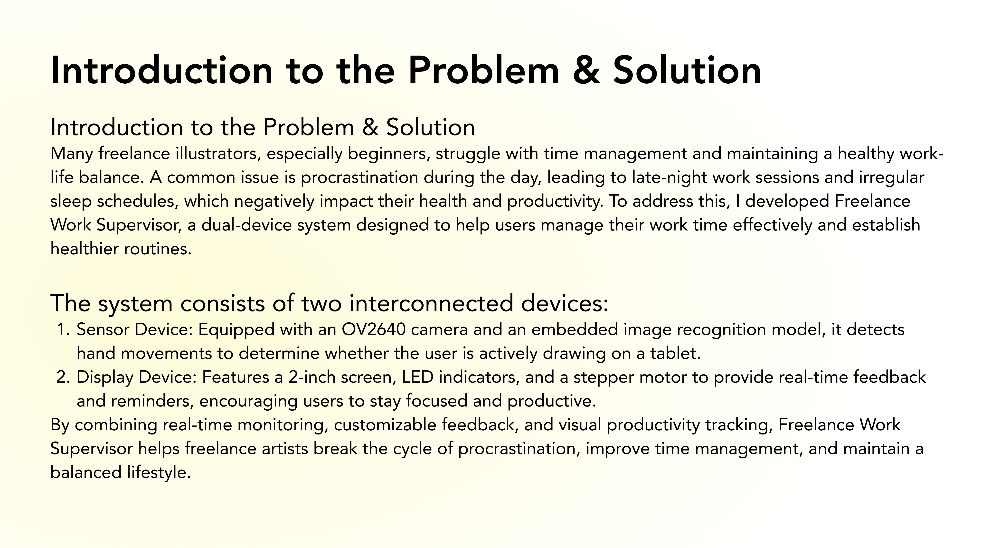

# Freelance_Work_Supervisor
A task monitoring device based on ESP32-S3-WROOM and a 5-inch screen.
It uses a camera to detect hand movements in real-time to determine whether the user is working. If prolonged inactivity is detected, the device will remind the user to stay focused.
Additional features include tracking total work hours throughout the day, displaying the current time, and providing real-time feedback on task completion progress based on the user’s actual performance.

## Appearance Sketch

## Sensor

## Display

## Devices communicate & detailed diagram

